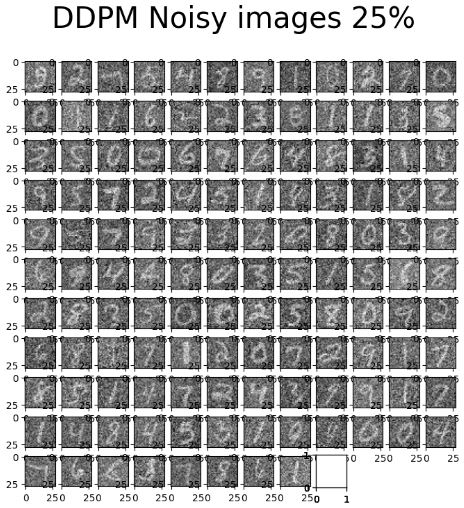
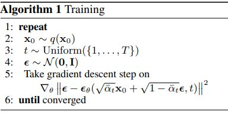
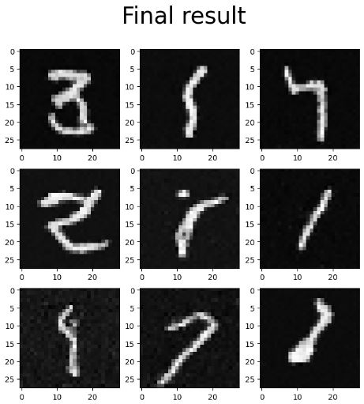

## Diffusion-Based Generative Models

Generally, all diffusion models have a forward process $q(x_{1:T} | x_0) = \Pi_{t = 1}^T q(x_t|x_{t-1})$, in which a **step-wise Gaussian noise** is added to the input image till the input becomes pure noise $N(0, I)$. (Note that the input can be any signal, not particularly image). 

The forward process is easy can be done recursively.

$$q(x_T | x_0) = N(x_t; \sqrt{\bar{\alpha_t}} x_0, (1 - \bar{\alpha_t})I)$$

Where $\bar{\alpha_t} = \Pi_{s=1}^t \alpha_s \space \space \space (0 < \alpha_s < 1)$ , and $1 - \bar{\alpha_t}$ is the noise variance added to $x_0$ to reach $x_t$.

Now we face the main obstacle. How do we get back from pure noise to the input image (or a similar image belonging to the input's distribution)? In other words, how is $p_{\theta}(x_{t-1} | x_t)$ computed?

### The First Approach: DDPM (Denoising Diffusion Probablistic Models)

Reference Paper: https://arxiv.org/abs/2006.11239

Source Code: https://medium.com/mlearning-ai/enerating-images-with-ddpms-a-pytorch-implementation-cef5a2ba8cb1

#### Training Step:

In this architecture, we try to estimate the noise previously added to $x_0$ which has led to $x_t$. In other words, we try to estimate $\epsilon$ in $x_t = \sqrt{\bar{\alpha_t}} x_0 + \sqrt{(1 - \bar{\alpha_t})}\epsilon$. To do so, we train a nueral network $\epsilon_{\theta}(x_t, t)$ which gets the noisy image $x_t$ and the time step $t$ as inputs, and outputs a random noise predicting $\epsilon$. 

Hence, the loss function can be written as: 

$${\theta}^* = argmin_{\theta} || \epsilon - \epsilon_{\theta}(\sqrt{\bar{\alpha_t}} x_0 + \sqrt{1-\bar{\alpha_t}} \epsilon, t) ||$$

Based on the loss function, the training algorithm becomes: 

#### Inference Step: 

Note that we already have $x_t$ when constructing $x_{t-1}$ in the backward trajectory. ( $p_{\theta}(x_{t-1} | x_t)$ )

### The Second Approach: Minimizing KL Divergence Between q(x(t-1) | x(t), x(0)) and p(x(t-1) | x(t))

Reference Paper: https://arxiv.org/abs/1503.03585

